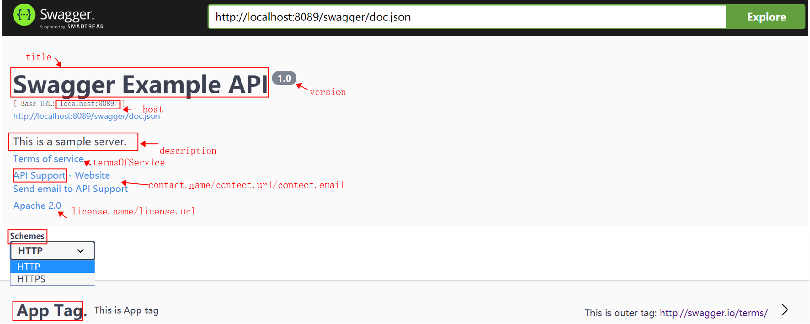
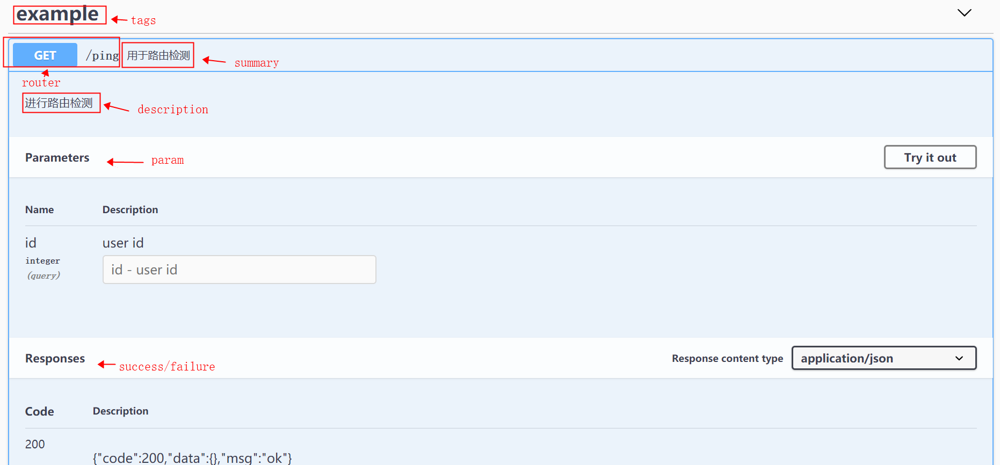

# 功能

swaggo 提供了自动生成 RESTful API 文档的功能。

# Get Started

API文档自动生成分为如下三步：
1. 给API代码增加注释。
2. 安装swag CLI
3. 生成API文档

## 代码添加注释

注释分为两类，
* 对整体功能的描述；
* 对每一个restful API的描述。

1.整体功能描述的注释常用的标签如下：

标签| 描述
---|---
@title|**必选**，APP标题
@version|**必选**，API版本号
@description|APP描述
@termsOfService|API服务条款
@contact.name|开放API的联系信息
@contact.url|一个指向联系信息的URL格式地址	
@contact.email|联系信息的email地址格式
@license.name|**必选**，API的License名称
@license.url|license的URL地址
@host|	API 的域名或IP
@BasePath|API的 base path

示例如下：
```go
// @title Swagger Example API
// @version 1.0
// @description This is a sample server Petstore server.
// @termsOfService http://swagger.io/terms/
// @contact.name API Support
// @contact.url http://www.swagger.io/support
// @contact.email support@swagger.io
// @license.name Apache 2.0
// @license.url http://www.apache.org/licenses/LICENSE-2.0.html
// @host localhost:8089
// @BasePath /
func main(){
	r := gin.Default()
	config := &ginSwagger.Config{
		URL: "http://localhost:8089/swagger/doc.json", //The url pointing to API definition
	}
	r.GET("/ping", get)
	r.GET("/swagger/*any", ginSwagger.CustomWrapHandler(config,swaggerFiles.Handler))
	r.Run(":8089")
}
```
效果如下：


2.API描述常用标签如下：

标签|	描述
---|---
@description|操作行为的详细解释
@id	|用于标识操作的唯一的字符串，必须在项目中唯一
@tags|每个API的tags列表，用逗号分隔
@summary	|操作内容的简短总结
@accept	|API可consume的MIME类型列表, MIME类型(Multipurpose Internet Mail Extensions type)详见后文注释规范详情链接。
@produce	|API可以produce的MIME类型列表
@param	|API参数,格式: param_name param_type data_type is_mandatory(bool值) comment_attribute(非必填).其中param_type包括 path, query 等。
@security|API Security
@success	|成功响应，格式： return_code {param_type} data_type comment
@failure	|失败响应， 格式： return_code {param_type} data_type comment
@router	|路由，格式: path [httpMethod]

响应消息中，param_type:
* object (struct)
* string (string)
* integer (int, uint, uint32, uint64)
* number (float32)
* boolean (bool)
* array

Data Type：
* string (string)
* integer (int, uint, uint32, uint64)
* number (float32)
* boolean (bool)
* user defined struct

示例如下：
```go
// @description 进行路由检测
// @summary 用于路由检测
// @tags example
// @accept json
// @produce  json
// @param id query int false "user id"
// @success 200 {string} json "{"code":200,"data":{},"msg":"ok"}"
// @failure 400 {string} json "{"code":400,"data":{},"msg":"fail"}"
// @router /ping [get]
func get(c *gin.Context){
	c.JSON(http.StatusOK, gin.H{
		"message": "pong",
	})
}
```
效果如下：


> 注释规范详见：
>* https://swaggo.github.io/swaggo.io/declarative_comments_format/general_api_info.html

## 安装Swag CLI

1.安装gin插件
```shell script
go get -u -v github.com/gin-gonic/gin
```

2.安装swag CLI
```shell script
go get -u github.com/swaggo/swag/cmd/swag
```

3.执行完成后，需要将swag所在路径设置为PATH，将$GOPATH/bin 加入到$PATH中：
```shell script
export PATH=$PATH:$GOPATH/bin
``` 

4.验证Swag CLI是否成功：
```shell script
swag -v
```

## 生成API文档

1.在项目根目录下执行下面命令，会生成一个 docs/目录，每次更新API注释都需要**重新执行**该命令才会更新API文档。
```shell script
swag init [command options] [arguments...]
```
可选参数：

命令 |描述
|---|---|
 --generalInfo value, -g value    |指定main函数的位置 (默认值: "main.go")
   --dir value, -d value       | 解析的路径 (默认值: "./")
   --exclude value              |解析时排除的路径和文件，用逗号分隔
   --propertyStrategy value, -p value|指定命名规范，如snakecase,camelcase,pascalcase (默认值: "camelcase")
   --output value, -o value           | 生成API文档docs/的目录，推荐放在项目根目录下(默认值: "./docs")
   --parseVendor                       |解析vendor文件夹中的go文件 (默认值: false)
   --parseDependency                   |解析外部依赖文件夹中的go文件(默认值: false)
   --markdownFiles value, --md value   |将markdown文件解析成description(默认值: false)
   --parseInternal                     |解析internal包中的go文件(默认值: false)
   --generatedTime                     |在docs.go文件开头加上时间戳 (默认值: false)
   --help, -h                          |show help (默认值: false)

例：当main函数不在项目根目录下时需要加上参数，指定main函数的位置。

```shell script
swag init --generalInfo ./cmd/main.go
```

2.将生成的 docs/目录隐式import。
新增路由：
```go
router.GET("/swagger/*any", ginSwagger.WrapHandler(swaggerFiles.Handler))
```
在设定路由的文件中，需要包含下列头文件：

```go
import (
	"github.com/gin-gonic/gin"
	swaggerFiles "github.com/swaggo/files"
	"github.com/swaggo/gin-swagger"
	_ "swaggo/start/docs" // docs is generated by Swag CLI, you have to import it.
)
```

3.查看API文档

浏览器打开host:port/swag/index.html 即可查看生成的API文档。

> 参考资料
> * swaggo源码：https://github.com/swaggo/gin-swagger
> * 官方文档：https://swaggo.github.io/swaggo.io/
> * 官方文档：https://godoc.org/github.com/swaggo/gin-swagger
> * 官方网站：https://swagger.io/support/
